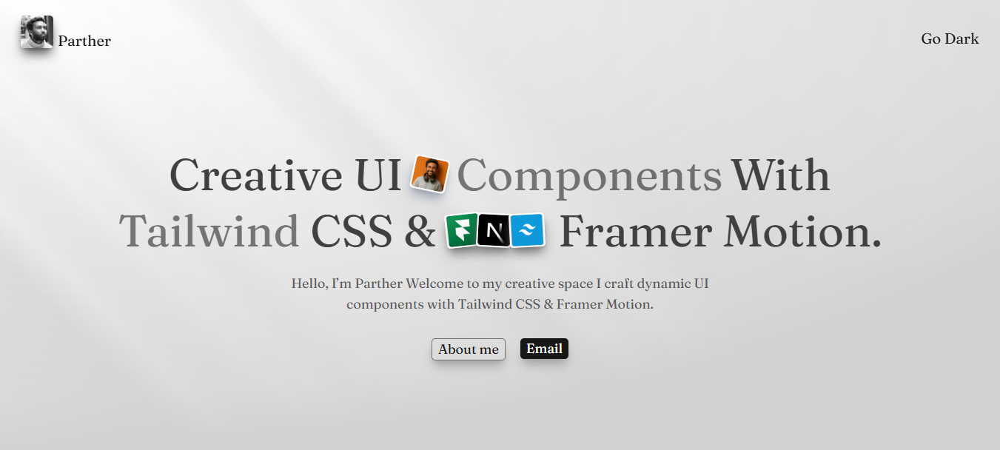

# ✨ Creative Components Blog  

> A blog dedicated to showcasing **interactive, animated, and creative web components** designed and developed with **Tailwind CSS** and **Framer Motion**.

<p align="center">
  
  <br/>
  <i>Learn. Explore. Build Creative Web Components.</i>
</p>

---

## 🚀 About This Blog

This blog is designed for **frontend developers and designers** who want to learn **how to build creative, interactive UI components**.  

- Explore **scroll animations, hover effects, dynamic layouts, and more**.  
- Each blog post includes **live demos, code explanations, and links** to help you understand and recreate the components.  
- Built with **React.js**, **Tailwind CSS**, and **Framer Motion** for a modern, responsive, and fast experience.  

---

## 🧩 Features

- 🎨 **Creative UI Components** – Focused on design, animation, and interactivity  
- ⚡ **Fast and Responsive** – Tailwind CSS ensures mobile-first responsive design  
- 🖼️ **Demo Cards** – Embedded live component previews in blog posts  
- 📖 **Structured Content** – Consistent format for posts: `DemoCard`, `CodeExplanation`, `LinkBlock`, etc.  
- 🔗 **Code & References** – All posts include relevant code snippets and external links  
- 🌐 **SEO Friendly** – Optimized for discoverability and sharing  

---

## 🛠️ Tech Stack

| Layer | Technology |
|-------|-------------|
| **Frontend** | React.js |
| **Styling** | Tailwind CSS |
| **Animations** | Framer Motion |
| **Routing & Pages** | React Router / Next.js Pages |
| **Data Management** | Local JSON / CMS-ready structure |

---

## ⚙️ Getting Started

### Prerequisites
- Node.js (v16 or newer)  
- npm or yarn  

### Installation & Running Locally
```bash
# Clone the repository
git clone https://github.com/parthergk/creative-components-blog.git
cd creative-components-blog

# Install dependencies
npm install
# or
yarn install

# Start development server
npm start
# or
yarn start
